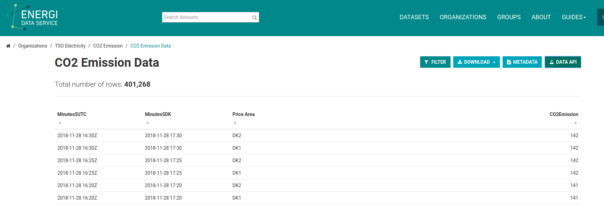

# An API for Sensors' Data

## Web Service

<!---
A mechanisms for exchanging data between disparate systems that are not developed --by the same parties.
--->

::: incremental

- Abstract and Connectionless Communication $\rightarrow$

- Client-Server Architecture $\rightarrow$

- HTTP

:::

<!---
So it's just a custom application on top of a database and behind a web server.
--->


## REST

::: incremental

- Read-Only $\rightarrow$ Stateless

- Only representation $\rightarrow$ Simplification

- One *collection of data* for each sensor

- One *resource* for each sensor data-point 

:::

## Ideal API

Only GET request:


```html
domain-name/api/sensor/timestamp
```

. . .

with self-explaining response:

```json
{
  "sensor": "Thermometer-0",
  data: [
          {
            "timestamp": "2018-11-11 21:11:11",
            "temperature": 20
          }
        ]
}
```


# Implementation

## Data Retrivial

::: incremental

- FTP server

- Polling for update and download <!--- daunting task --->

- Preprocessing with pandas (from csv)

:::

## - Database creation 

- One *table* per collection

- One row per data-point

## Flask

- Simple web server

- Per-url function

. . .

### Problem

- Low-level

- Lacking default security

## Libraries

> SQLAlchemy Introspection + Flask = "sandman"

. . .

### Unreliable

Lackluster support for timestamps as text and bugs

. . .


### Enter Datasette

Developed especially for publicing read-only data from database


**Bonus**

: Implements advanced queries and even SQL quries.
  No security concerns given the read-only property.

## Example

\scriptsize
```html
GET http://127.0.0.1:8001/db-a23fb6b/CO2/2018-11-04+00:00:00.000000.json
```
\normalsize
note: .json is just appended to just one of the possible formats

\tiny
```json
{
  "database": "db", 
  "table": "CO2", 
  "rows": [
            ["2018-11-04 00:00:00.000000", 527, ..., 0]
          ], 
  "columns":  [
                "Timestamp", 
                "Centrale kraftv\u00e6rker DK1", 
                ..., 
                "Solceller DK2"
              ],
  "primary_keys": ["Timestamp"], 
  "primary_key_values": ["2018-11-04 00:00:00.000000"], 
  "query_ms": 0.45609474182128906
}
```
\normalsize

# API Reference

## Brief API Doumentation

```html
GET /[database-id/]table-name/resource-id
```

. . .

```html
GET /[database-id/]table-name/YY-MM-DD+h:m:s.ms.json
```

\footnotesize
with query string parameters for quick search `?attribute1=name&attribute2=140`
\normalsize

### Bonus
All sort of advanced search options (SQL, facets, text search) are freely inspectable through a web page and thorugh:
`/-/inspect`

## Example Screenshot


# Conclusion

## Success

> In this way all the **cold database** can be easly made accessible to the public in a programmtic way

## Surprise



